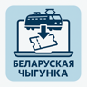

# RW Ticket Downloader

A Firefox extension that automatically downloads train tickets from [pass.rw.by](https://pass.rw.by) and saves them as JPEG images.



## What it does

1. Open an order page on pass.rw.by
2. Click the extension icon in the toolbar
3. Click **"Скачать билеты"** (Download tickets)
4. The extension finds all PDF ticket links, converts each one to a JPEG, and saves it to your Downloads folder

Files are saved with names like: `ticket_2026-06-05_17005825_1.jpg`

## Tech stack

- **TypeScript** → compiled with webpack
- **PDF.js** (pdfjs-dist) — renders PDF pages to images
- **WebExtension API** (Manifest V2) — compatible with Firefox Desktop and Firefox Android

## Development setup

```bash
cd rw-ticket-downloader
npm install
npm run build
```

The built extension will appear in the `dist/` folder.

## Loading the extension

### Firefox Desktop

1. Go to `about:debugging#/runtime/this-firefox`
2. Click **Load Temporary Add-on...**
3. Select `rw-ticket-downloader/dist/manifest.json`

> The extension is temporary and will be removed on Firefox restart. Reload it via `about:debugging` after each restart.

### Firefox Android

Requires **Firefox Nightly** or USB connection via `web-ext`:

```bash
npm install -g web-ext
cd rw-ticket-downloader/dist
web-ext run --target=firefox-android --android-device=<device-id>
```

## Development with watch mode

```bash
cd rw-ticket-downloader
npm run dev
```

## Project structure

```
rw-ticket-downloader/
├── src/
│   ├── background.ts   # PDF → JPEG conversion and file saving
│   ├── content.ts      # Finds PDF links on the page and fetches them
│   ├── popup.ts        # Toolbar popup UI logic
│   └── types.d.ts      # Shared message types
├── public/
│   ├── manifest.json   # Extension manifest (MV2)
│   ├── popup.html      # Popup interface
│   └── icons/          # Extension icons
├── dist/               # Compiled extension (after npm run build)
├── webpack.config.js
├── tsconfig.json
└── package.json
```

## How it works

```
Toolbar button click
    → popup.ts sends message to content.ts
        → content.ts scans DOM for links with pdf=1
        → fetch() with cookies (same-origin) → ArrayBuffer → base64
        → sends base64 to background.ts
            → background.ts: PDF.js renders page 1 into OffscreenCanvas
            → canvas → JPEG Blob → downloads.download()
                → file saved to Downloads folder
```

## Requirements

- Firefox 109+
- Node.js 18+ (for building)
